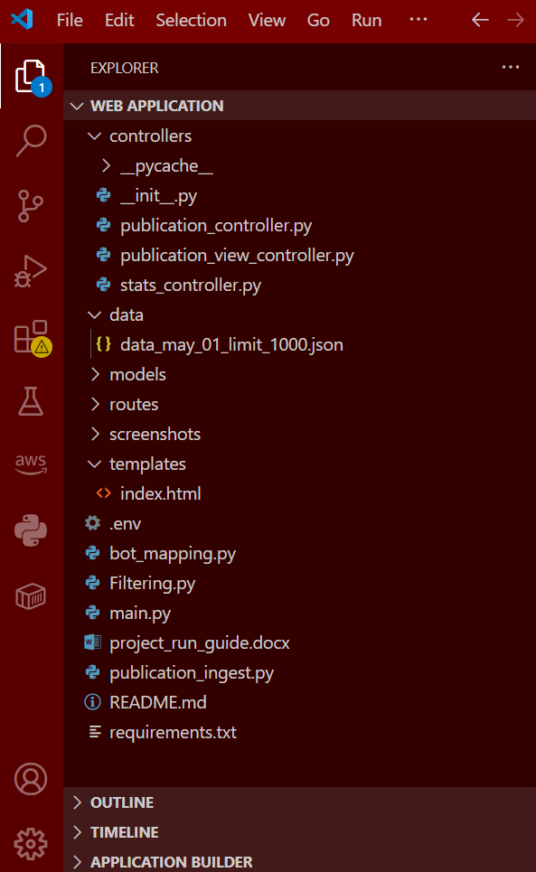
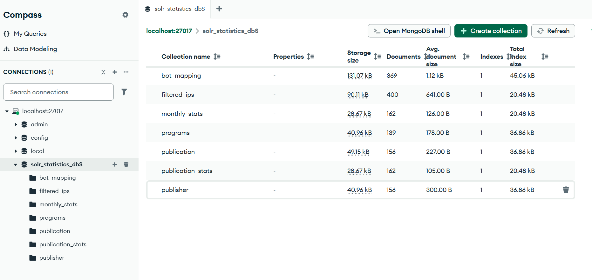
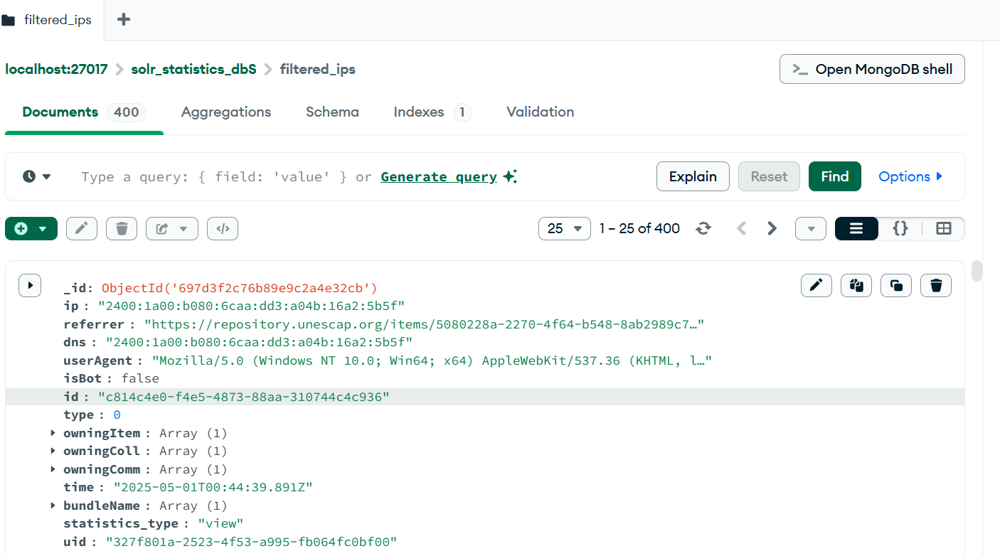

# 📊 UNESCAP DSpace 7 Analytics — Bot-Filtered Usage Statistics Backend

**Organization:** United Nations ESCAP (Asia-Pacific)  
**Project Type:** Industry-Partnered Academic Internship Experience  
**Role:** Backend Developer / Data Engineer  
**Technologies:** Python, MongoDB, REST APIs, External IP Intelligence APIs, DSpace 7, Drupal (PHP)

---

## Project Overview

Institutional repositories rely on usage statistics such as **downloads** and **page views** to measure the impact and reach of publications. However, these statistics are often **severely distorted by automated bot traffic**, including crawlers, VPNs, proxies, and hosting services. This project delivers a **production-ready backend analytics system** that filters bot-affected records from UNESCAP’s DSpace 7 repository, producing **clean, reliable, and auditable statistics** for reporting and decision-making.

This system was designed and implemented in collaboration with a supervisor at **UNESCAP (United Nations Economic and Social Commission for Asia and the Pacific)** as part of a professional, internship-equivalent university course.

---

## Problem Statement

DSpace 7 exposes raw usage logs but does not reliably distinguish between **human users and automated agents**. As a result:
- Download and view counts are inflated
- Analytics cannot be trusted for reporting
- Impact assessments become misleading

The challenge was to design a backend system capable of **accurately identifying bot traffic**, filtering it at scale, and persisting only meaningful interactions.

---

## System Architecture

The backend follows a multi-stage pipeline:
1. Ingest raw usage statistics
2. Extract and deduplicate IP addresses
3. Classify IPs using an external intelligence API
4. Persist bot classifications in MongoDB
5. Filter statistics using stored classifications (not raw files)
6. Produce clean, publication-linked analytics

---

## Database Design (MongoDB)

The database schema was modeled directly from functional requirements and includes:
- `bot_mapping`: IP address classifications (bot / non-bot)
- `filtered_ips`: Bot-free usage records
- `statistics`: Aggregated analytics
- `publication`: Publication metadata
- `programs` and `publisher`: Organizational metadata

This design ensures **reusability, traceability, and scalability**.

---

## Code Structure and Responsibilities

run_bot_mapping.py → Classifies IP addresses using external APIs
filter_statistics.py → Filters statistics using MongoDB bot mappings
publication_ingest.py → Fetches publication metadata via DSpace REST APIs
.env → Secure configuration and credentials

### run_bot_mapping.py
Extracts unique IP addresses from raw statistics, queries an external IP intelligence API, identifies bots based on VPN/proxy/hosting signals, and stores the results in the `bot_mapping` collection to avoid redundant lookups.

### filter_statistics.py
Filters usage records by referencing **only the MongoDB bot mapping collection**, ensuring no dependency on raw JSON files. Clean records are stored in `filtered_ips` for downstream analytics.

### publication_ingest.py
Consumes DSpace 7 REST APIs to retrieve publication metadata and links filtered usage statistics to owning items, collections, and communities.

---

## Output Example

## 🚀 Outcomes and Impact

- Removed bot traffic from repository analytics

- Restored credibility of download and view statistics

- Enabled accurate reporting for institutional decision-making

- Delivered a reusable analytics backend applicable to other DSpace repositories

- Provided a foundation for dashboards and future ML-based bot detection

## 💼 Skills Demonstrated

- Backend development with Python

- MongoDB data modeling and indexing

- REST API integration (DSpace 7)

- External API consumption and rate control

- Data filtering and validation pipelines

- Secure environment configuration

- Real-world analytics system design

## 🎓 Learning Outcomes Achieved

- Modeled and implemented a MongoDB database from user requirements

- Built a scalable backend web-application using Python and MongoDB

- Integrated external APIs into a production workflow

- Categorized IP addresses as bots using external intelligence services

- Supported CMS-level integration with Drupal-based systems

## 👔 Professional Context

This project was completed as part of a supervised, industry-partnered academic course designed to provide professional experience equivalent to an internship, in collaboration with the United Nations ESCAP.

---

👩🏻‍💻 Author

⭐ NAME: Naomi Bambara

🤖 GitHub: https://github.com/Joliage

🌐 LinkedIn: https://www.linkedin.com/in/naomie-bambara-0023201a2 